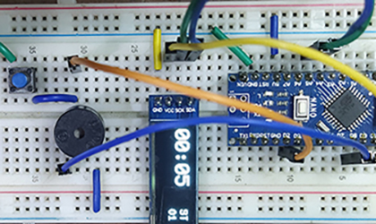
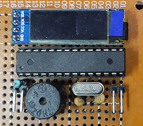

# Pomodoro Timer with Arduino
Arduino-based pomodoro timer. Read about Pomodoro Technique at
https://en.wikipedia.org/wiki/Pomodoro_Technique

 

## Features
* Cycles through 3 states viz.:
  * __Study__ state (25 minutes).
  * __Break__ state (5 minutes) after study states.
  *  __Long Break__ state (15 minutes) instead of __Break__ state after every 4 study cycles.
* User input (button press) is required after each state to go to the next state.
* Timer can be paused/resumed during __Study__ state. However, __Break__ and __Long Break__ states cannot be paused.
* While the timer is paused or between states, it will go to sleep to save battery life.
* If the timer is sleeping for `IDLE_DURATION` (1 minute in my example), it will turn the display off to further reduce battery usage.
* Timer can be awakened from sleep with a button press.
* The screen displays the following:
  * Time in minute and second, prominently on the left side.
  * Current state, on the top right (`ST` - Study, `BR` - Break, `LB` - Long break)
  * Number of Pomodoros, on the bottom right.
* Buzzer beeps after each state. 2 short beeps after studies and 6 slightly longer beeps after breaks.

## Bill of Materials
* OLED 0.91 inch 128x32 display
* Active buzzer
* Momentary push button
* For prototyping
  * Arduino Nano (other boards such as Uno, Pro Mini, etc. will also work)
* For final use
  * ATmega328p
  * 16 Mhz crystal
  * 22 pf capacitors (2 nos)
  * 10k Ohm resistor

## Libraries Used
* U8g2 (https://github.com/olikraus/u8g2)
* arduino-timer (https://github.com/contrem/arduino-timer)
* Bits of codes (no need to include these) from:
  * https://github.com/cbm80amiga/HX1230_CountdownTimer (low power)
  * https://gammon.com.au/forum/?id=11488&reply=1#reply1 (button debounce)

## Changing durations of states and idle period
You can change the following in `functions.h` file.
```
#define IDLE_DURATION 60
#define STUDY_MINUTE 25
#define BREAK_MINUTE 5
#define LONG_BREAK_MINUTE 15
```  
## Changing physical pins
You can change the following in `functions.h` file depending on your board layout.
```
#define DISPLAY_POWER_PIN 9
#define SCL_PIN SCL
#define SDA_PIN SDA
#define BUZZER_PIN 8
#define BUTTON_PIN 2
```